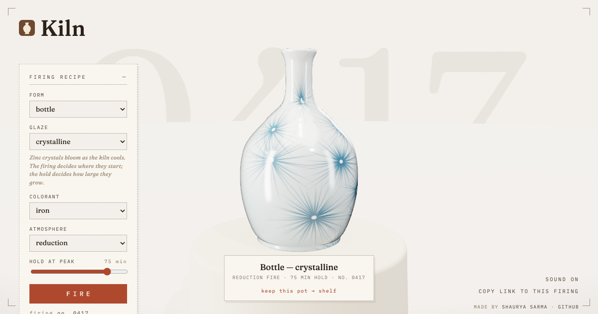

# Kiln

**Throw, glaze, and fire pottery in the browser — the kiln gets the final say.**

**Live: [kiln.shaux.dev](https://kiln.shaux.dev)** · Figma plugin (in Community review) · [full build log](docs/BUILDLOG.md)



## The idea

I spend my weekdays in digital tools where everything obeys me — every pixel lands where
it's put, everything previews, everything undoes. I spend my weekends at a pottery
wheel, where I control the *conditions* — the profile I throw, the glaze I mix, the
firing schedule — and then the kiln decides. Potters describe opening a kiln like
Christmas morning, because you genuinely don't know what you'll get. Digital design has
no moment like that. Nothing is ever a surprise.

Kiln is what happens when those two lives finally work on one project. The guiding
question:

> **What happens when you bring a medium defined by *surrendered control* into the tool
> defined by *total control*?**

You pick a form (or draw one in Figma with the pen tool — a potter's wheel is just a
machine that spins a silhouette), mix a glaze the way potters actually do (base recipe,
metal-oxide colorant, kiln atmosphere, soak time), and press **FIRE**. The room goes
dark, the kiln roars, and the pot you get back has the firing's fingerprints on it —
crystals that grew where they wanted, blushes where the flame licked, drips that ran as
far as gravity took them. Fire the same recipe again and the kiln answers differently.
You keep the good ones on the shelf.

Two moments pushed the idea from notebook to build. Figma's Config 2026 theme was
literally *new materials on the canvas* — code, motion, and shaders as things designers
work with — and clay is the oldest material humans have ever designed with. And I found
[Kilnmuse](https://kilnmuse.app), an AI tool that predicts glaze firings so potters can
*avoid* the kiln's surprises — which crystallized what Kiln had to be: the opposite.
Kilnmuse predicts the kiln so potters can avoid its surprises; **Kiln imports the kiln
so designers can have them.**

## What's in it

**The playground** ([kiln.shaux.dev](https://kiln.shaux.dev))

- Six glazes with real ceramics behavior, all procedural, all seeded: **celadon**
  (iron in translucent glass — pale where thin, deep where it pools), **crystalline**
  (zinc spherulites that grow with the soak), **tenmoku** (iron black breaking to rust
  on the rim, oil spots where bubbles surfaced), **shino** (the glaze that does what it
  wants — flame blushes and trapped carbon), **copper red** (blood-red in reduction,
  the same recipe fires green in oxidation), **ash** (rivulets — gravity made visible).
- Real firing variables: metal-oxide **colorant** (iron/cobalt/chrome/manganese/rutile),
  kiln **atmosphere**, and **hold at peak** — a longer soak matures every melt.
- Every firing is a seed. The URL reproduces the exact pot; **the shelf** stores kept
  pots as recipes (a few bytes each) and replays them forever.
- Grab the pot and spin it like a wheel head — a flick leaves momentum. A warm
  inspection lamp rides your cursor across the glaze. The firing sequence has a
  synthesized soundtrack (a kiln's pressure-roar, the ring of set-down stoneware) —
  no audio files, all Web Audio primitives.

**The Figma plugin**

- Draw the right half of a pot's silhouette with the pen tool, select it, and Kiln
  throws it — live, re-thrown on every selection change.
- Place renders on the canvas (optionally transparent), where each pot carries its full
  recipe, a **Re-fire in Kiln** relaunch button, and a **See it live in 3D** link to its
  exact playground firing.
- **Test tiles ×9**: nine firings of one recipe placed as a real component set — each
  firing a variant with a `firing` property. Potters explore glazes with test-tile
  grids; designers explore options with variants. Same artifact.

## How it works (the short version)

One engine, two thin shells: a framework-free TypeScript engine (profile math, lathe
geometry, glaze materials, the firing simulation) consumed by the Vite playground and
the Figma plugin's sandboxed iframe. Everything is procedural — no image files, no
fetched HDRs, no audio files — because the plugin iframe has no network, and because
generating everything from the firing's seed is the whole point.

Favorite pieces, told properly in the [build log](docs/BUILDLOG.md):

- A pot is a 2D curve, spun: Catmull-Rom smoothing, arc-length resampling (so texture
  space measures real distance along the wall), and a concavity pass that computes
  where molten glaze would pool — baked into the mesh for every glaze to read.
- Glaze color follows light path length (Beer–Lambert absorption with a view-angle
  secant) — why real celadon is pale face-on and jade at the silhouette, and why
  potters tilt a pot to judge a glaze.
- The lighting is a procedural photographic studio pre-filtered into an environment
  map — including the non-obvious lesson that glass reads as glass because of
  *contrast* in reflections, not brightness.
- Crystalline growth follows the real kinetics: the seed decides where crystals
  nucleate, the hold time decides how large they grow.
- The wrap-seam purity rule: a tiling texture must be a pure function of a precomputed
  plan — any randomness inside the draw call breaks the seam. Found the hard way,
  diagnosed with a debug view that rolls the texture half a width.
- WebGPU-first rendering (materials written in TSL, compiled to WGSL) with a verified
  WebGL2 fallback — which is also what the plugin pins for reliable canvas readback.

## How this was built

Kiln was designed, art-directed, and driven by me over one weekend (Aug 8–10, 2026),
built with AI pair-programming (Claude) across the whole stack — including parallel
agent sessions for focused investigations like the rendering-quality pass, the sound
palette, and the cursor system. The concept, the pottery knowledge, every aesthetic
call, and the product decisions are mine; the [build log](docs/BUILDLOG.md) is the
unabridged engineering narrative, and the commit history is unedited (co-author
trailers included). I believe this is simply how strong tools get built now — taste,
domain knowledge, and direction are the scarce ingredients, and I'm happy to defend
every line of this codebase in person.

## Running locally

```bash
pnpm install
pnpm dev          # playground at localhost:5173
pnpm typecheck    # engine + playground + plugin
```

For the Figma plugin: `pnpm --filter @kiln/figma-plugin build`, then in the Figma
desktop app: *Plugins → Development → Import plugin from manifest…* →
`packages/figma-plugin/manifest.json`.

Useful debug views: `?debug=sound` (audition every synthesized sound),
`?debug=cursor` (the cursor state board), `?debug=texture&shift=1` (glaze textures
flat, seam-check mode), `?demo=1` (pre-stocked shelf).

## Roadmap

- **The multiplayer kiln**: a Figma widget where a whole team loads one kiln and fires
  it together — widget state is natively multiplayer, and a communal kiln opening is
  the most honest use of it.
- **Fire your brand**: derive a glaze from a selection's fills or the file's color
  variables — pot your design system.
- Dev Mode codegen: a placed pot hands you its TSL material as code.

## Credits

Type: [Fraunces](https://github.com/undercasetype/Fraunces) and
[IBM Plex Mono](https://github.com/IBM/plex), self-hosted via Fontsource.
Rendering: [three.js](https://threejs.org). Everything else grown from seeds.

MIT © Shaurya Sarma
